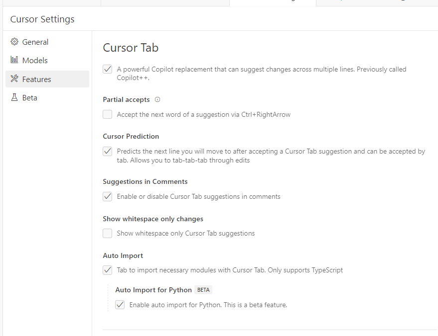
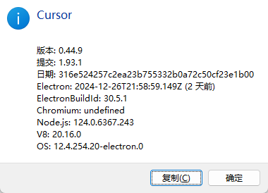
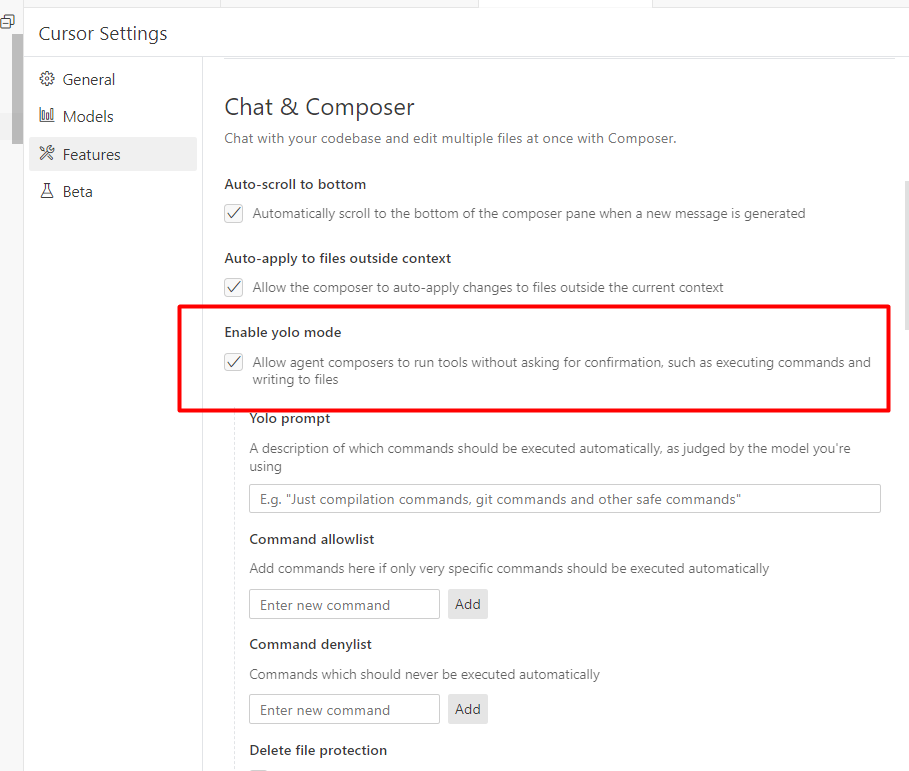
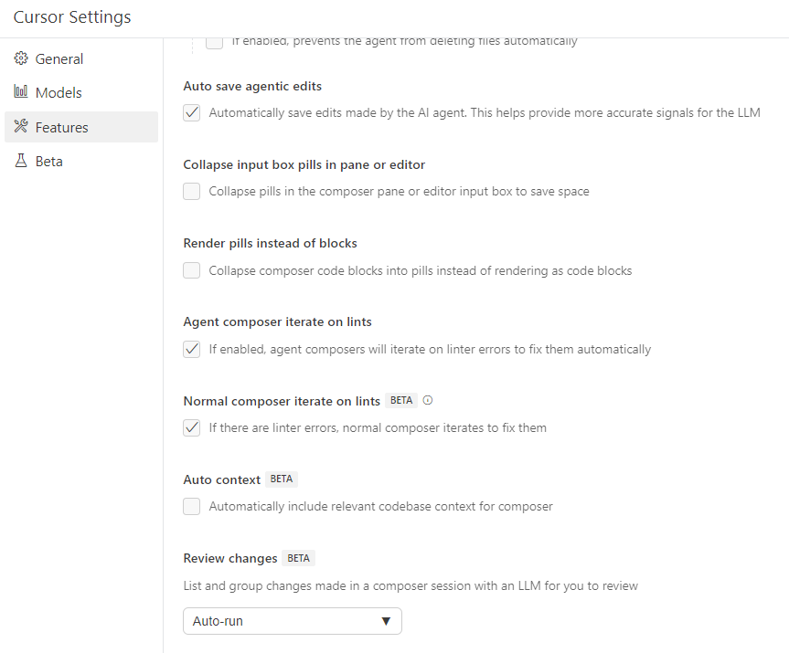
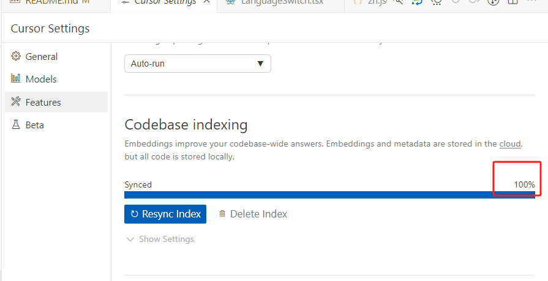
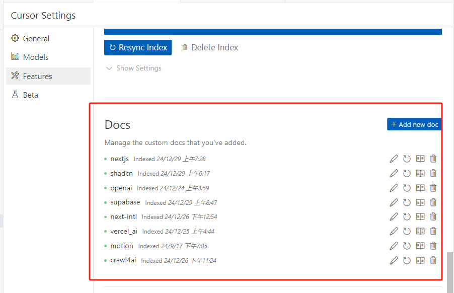
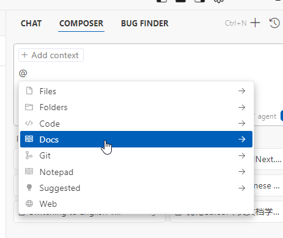
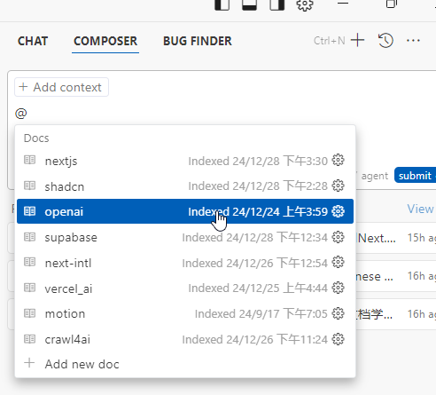
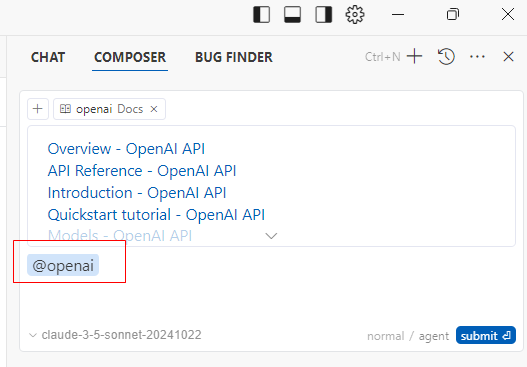

### 01 开启 Tab等

### 02 开启 yolomode-（重点）

这里需要更新到最新版本 
1. https://www.cursor.com/changelog (查看最新版本是哪个版本）
在 帮助→关于 查看你当前的版本

### 03 开启agent composer iterate等配置

### 04 CodeBase indexing（重点）

这里是重点，打开一个新项目时，cursor会自动索引，要检查这里索引完成之后，再进行使用

### 05 配置Docs（重点）

这个也是重点，用到的技术栈都可以索引起来，遇到问题，直接@docs 选择具体的文档进行提问

