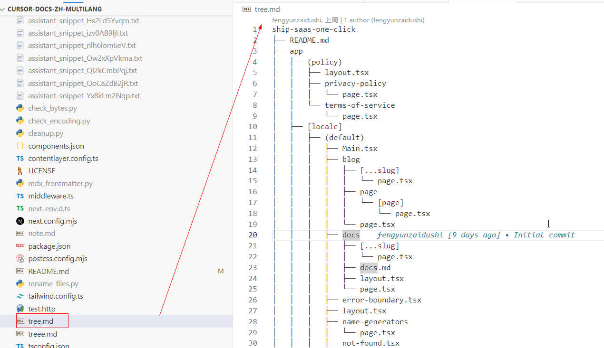

可以使用下面命令，生成项目文档结构图
# windows 生成项目结构（忽略常见开发文件） 
```
treee -I "node_modules|.git|.next|.contentlayer|.husky |packages|.vscode|.turbo|tests|ui|public|LICENSE|test.http" > tree.md
```

# macos/linux
```
tree -I "node_modules|.git|.next|.contentlayer|.husky|packages|.vscode|.turbo|tests|ui|public|LICENSE|test.http" > tree.md
```

执行后，会有如下效果

``` 
ship-saas-one-click
├── README.md
├── app
│   ├── (policy)
│   │   ├── layout.tsx
│   │   ├── privacy-policy
│   │   │   └── page.tsx
│   │   └── terms-of-service
│   │       └── page.tsx
│   ├── [locale]
│   │   ├── (default)
│   │   │   ├── Main.tsx
│   │   │   ├── blog
│   │   │   │   ├── [...slug]
│   │   │   │   │   └── page.tsx
│   │   │   │   ├── page
│   │   │   │   │   └── [page]
│   │   │   │   │       └── page.tsx
│   │   │   │   └── page.tsx
│   │   │   ├── docs
...
...
├── utils
│   └── supabase
│       ├── client.ts
│       └── middleware.ts
└── yarn.lock
```

有了这个文件，当需要全局搜索文件时，可以@tree.md ，这样就能方便cursor找到代码。
