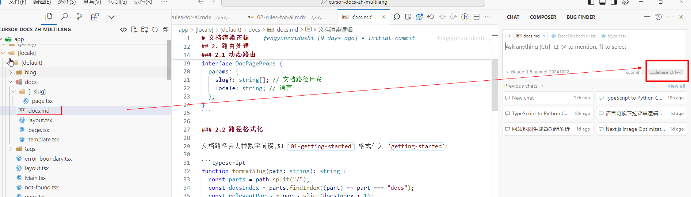
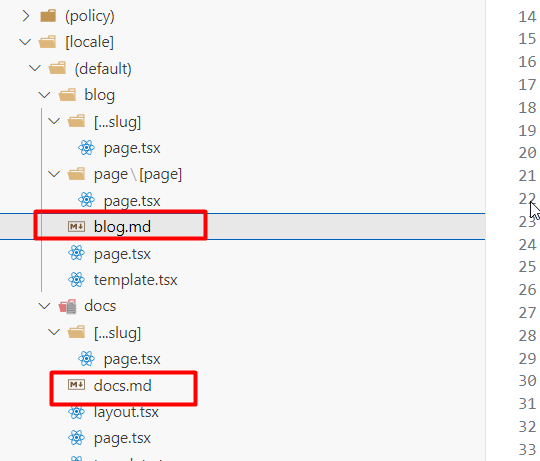
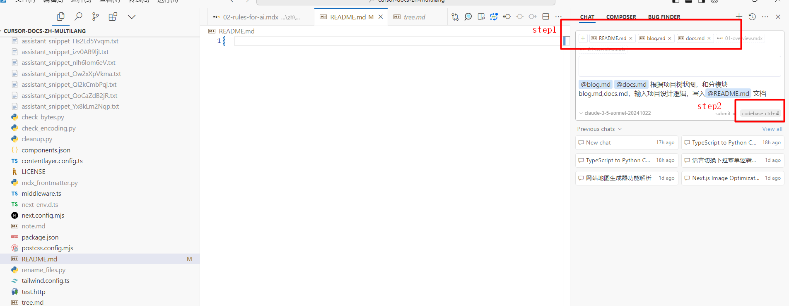
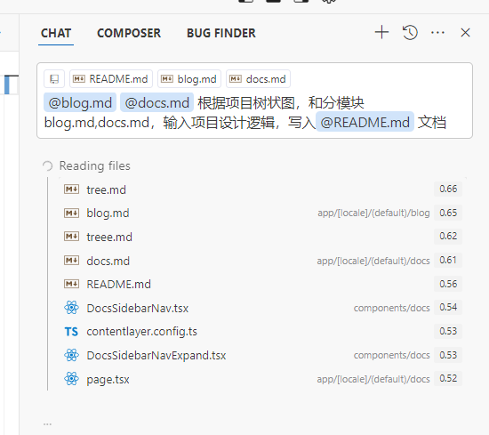
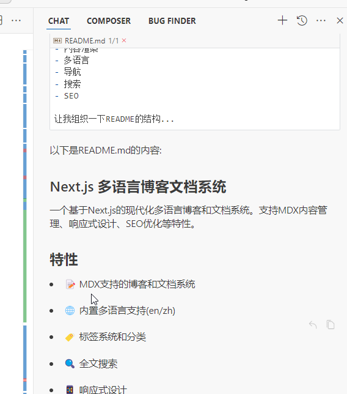
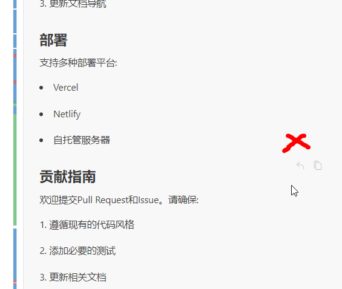
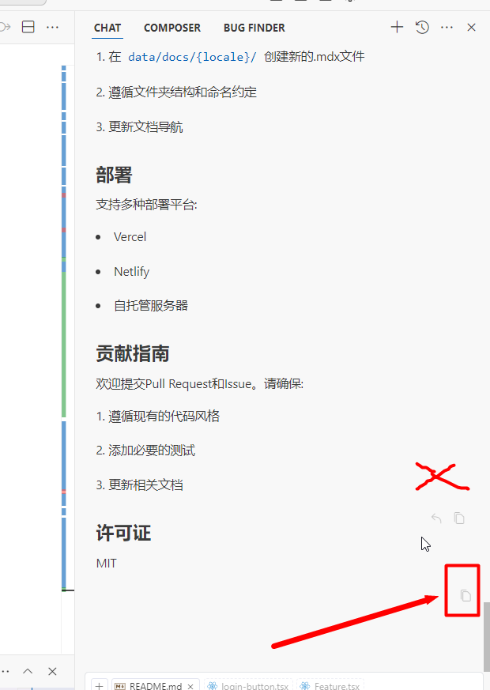

## 01 使用codebase梳理项目逻辑
针对没过功能的模块需求，可以这样说：
提前在想要写入的位置，创建文档。比如下面截图的 docs.md
```
请帮我把docs相关代码的渲染逻辑，写入docs.md文档。（然后选择 ctrl/command+Enter）
```


## 02 其他的模块逻辑类似


## 03 梳理整体项目逻辑
有了前面的文档项目树状图，以及分模块的逻辑，就可以梳理整体项目的逻辑

```
@blog.md @docs.md 根据项目树状图，和分模块blog.md,docs.md，输入项目设计逻辑，写入@README.md 文档
```


使用 ctrl/command+Enter键后，cursor就会分析：


## 04 找到最后的复制按钮
chat模式，不会直接写入内容到文件，需要手动复制：
可以看到有很多 复制按钮，我们要选择最后一个，这样就能直接全部内容。


